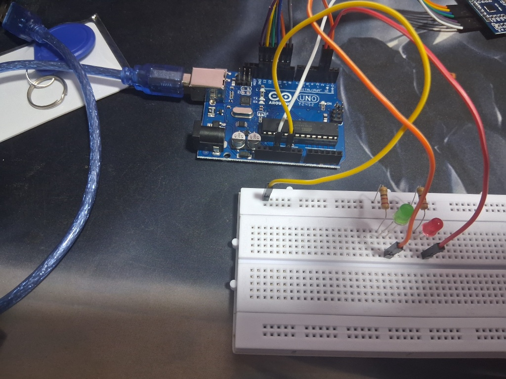
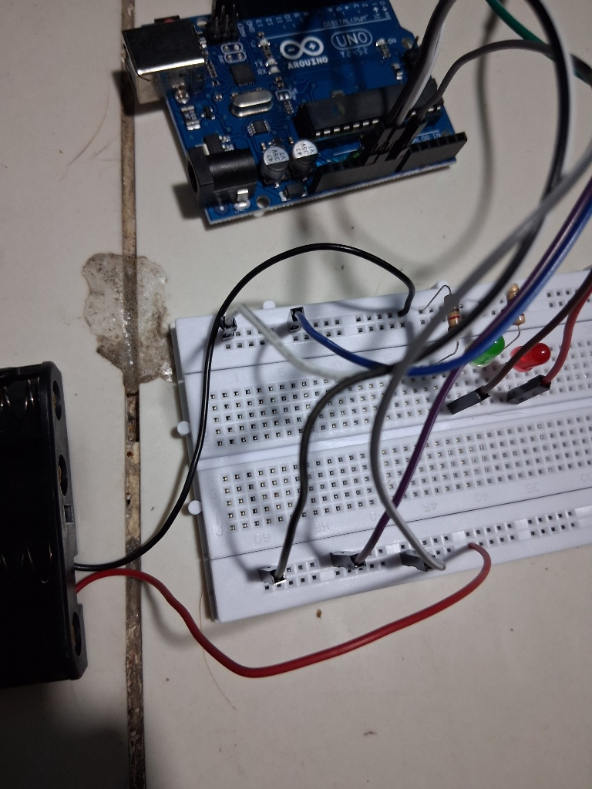
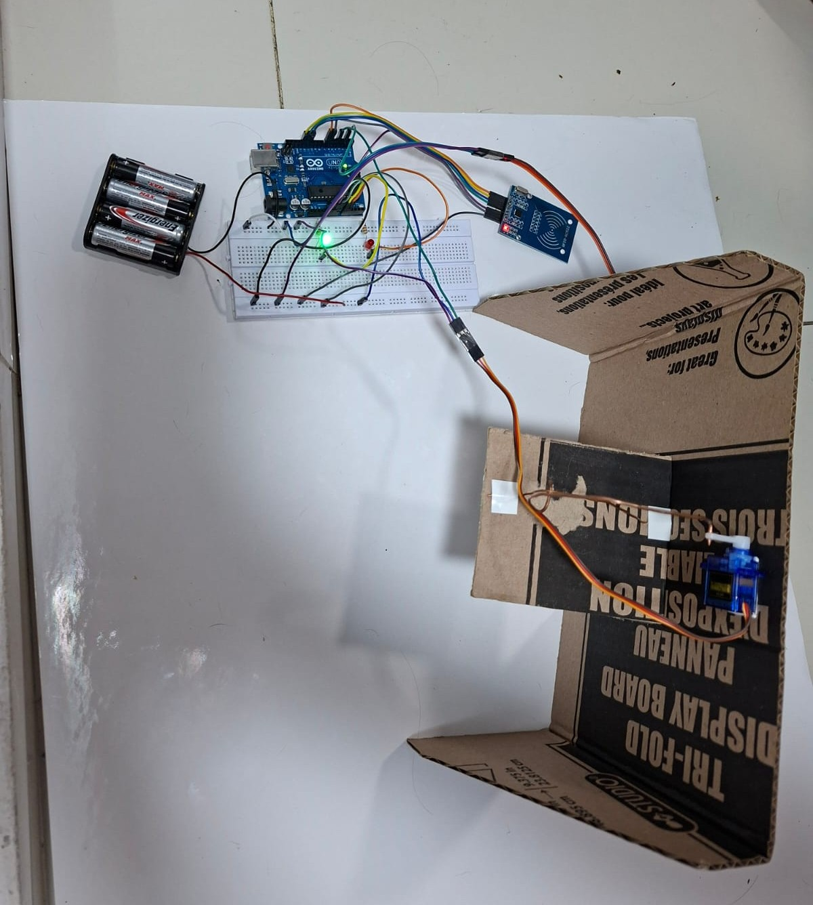
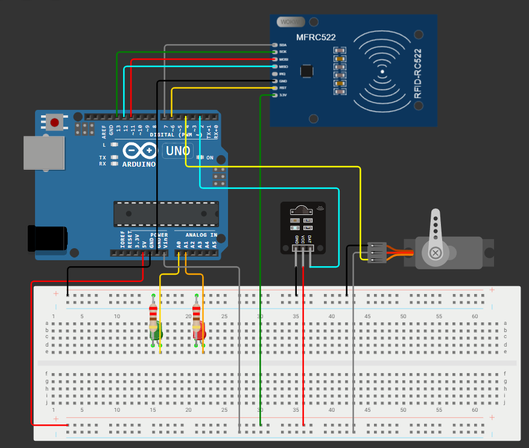

# Sistema de Control de Acceso Residencial Automatizado con Validación RFID e Infrarrojo

## Integrantes
- **Andrés Felipe Mancilla Santiago**

## Descripción del proyecto
Este proyecto consiste en el desarrollo e implementación de un prototipo a escala para un sistema automatizado de control de acceso y seguridad perimetral inteligente. El dispositivo realiza la validación de usuarios mediante tecnología de radiofrecuencia con un lector RFID (MFRC522), el cual acciona físicamente un servomotor para la apertura controlada de una compuerta. Paralelamente, el sistema integra un sensor óptico infrarrojo (IR) encargado de realizar un monitoreo continuo de presencia en las zonas adyacentes a la entrada, reportando alertas preventivas en tiempo real. Para garantizar una correcta retroalimentación visual, el circuito gestiona dos indicadores luminosos (LEDs) que señalizan de forma inmediata el estado de los permisos de ingreso o las alertas del entorno.

## Problema identificado
Los sistemas convencionales de control de acceso basados en cerraduras mecánicas tradicionales presentan notables deficiencias en los entornos de seguridad modernos, tales como la susceptibilidad a la duplicación no autorizada de llaves y la ausencia completa de registros de auditoría o monitoreo preventivo. 

Al no contar con sensores de proximidad perimetrales, las intrusiones en zonas restringidas solo son detectadas una vez que la barrera física ha sido vulnerada. La automatización de estos accesos mediante microcontroladores y sensores complementarios mitiga activamente estas fallas operativas, optimiza los tiempos de respuesta ante intrusos y disminuye de forma drástica los falsos positivos en maquetas de control inteligente y entornos reales.

## Objetivo general
Diseñar, cablear y programar un sistema electrónico autónomo e inteligente de control de acceso residencial combinando lectura por radiofrecuencia (RFID) y detección de proximidad óptica (Infrarrojo), administrado por una placa de desarrollo Arduino Uno, para la activación precisa de actuadores mecánicos y señales luminosas de estado.

## Objetivos específicos
- Establecer y sincronizar la interfaz de comunicación SPI entre el chip de lectura MFRC522 y el microcontrolador para la captura e interpretación confiable de códigos UID binarios.
- Desarrollar una lógica de control en código para el sensor infrarrojo digital, implementando lecturas en estados invertidos para la detección de presencia perimetral continua.
- Diseñar un esquema de distribución de energía estable que acople un banco de baterías externo de 6V al pin VIN, logrando absorber los picos de demanda eléctrica del servomotor sin comprometer la alimentación lógica de la placa.
- Implementar circuitos de salida con resistencias de protección acoplados a pines de estado analógicos/digitales para el manejo seguro de los indicadores de respuesta visual (LEDs).

## Componentes utilizados

| Componente | Cantidad | Función |
| :--- | :---: | :--- |
| **Arduino Uno** | 1 | Microcontrolador central encargado de procesar la lógica de control del programa. |
| **Lector RFID MFRC522** | 1 | Módulo de comunicación por radiofrecuencia para escaneo de llaveros y tarjetas de acceso. |
| **Sensor Infrarrojo Digital** | 1 | Transmisor y receptor óptico para la detección perimetral de obstáculos o presencia. |
| **Servomotor** | 1 | Actuador mecánico encargado de la apertura y cierre físico de la compuerta de la maqueta. |
| **LED Verde** | 1 | Indicador visual de estado para accesos autorizados legítimamente. |
| **LED Rojo** | 1 | Indicador visual de estado para accesos denegados o alertas de seguridad. |
| **Resistencias de 220Ω** | 2 | Componentes pasivos para la limitación de corriente eléctrica hacia los LEDs. |
| **Portapilas (4 Baterías AA - 6V)** | 1 | Bloque de alimentación externa para brindar autonomía energética total a la maqueta. |
| **Jumpers y Protoboard** | Varios | Elementos de interconexión física y distribución de las líneas de voltaje y tierra común. |

## Arquitectura del sistema
Lector RFID (MFRC522) → Arduino Uno (Bus SPI - Pines 11, 12, 13, 6, 7)
Sensor Infrarrojo Digital → Arduino Uno (Pin Digital 2)
Portapilas Externo (6V) → Arduino Uno (Pin VIN) y Servomotor (Cable Rojo)
Arduino Uno (GND) → Rieles de Tierra Común (Protoboard)
Arduino Uno → Servomotor (Pin Digital 4 PWM)
Arduino Uno → LEDs Indicadores de Estado (Pines Analógicos A0 y A1)

## Funcionamiento
1. **Fase de Inicialización:** Al energizarse el circuito por medio del portapilas de 6V, el Arduino Uno inicia la comunicación serial, activa el bus SPI y posiciona inmediatamente el servomotor en 0 grados, garantizando que la puerta inicie firmemente cerrada.
2. **Monitoreo Perimetral Continuo:** El programa lee de forma constante el pin digital del sensor infrarrojo. Al aproximarse un objeto, el sensor emite una señal digital `LOW`, gatillando instantáneamente una alerta en los registros del sistema.
3. **Escaneo de Identificación:** Al aproximar un llavero o tarjeta al campo electromagnético del lector MFRC522, este captura el identificador único (UID) y lo transmite al microcontrolador.
4. **Validación de Credenciales:** El Arduino Uno ejecuta un ciclo de comparación de arreglos binarios para confrontar el UID leído con el parámetro estático almacenado como tarjeta maestra:
   - **Acceso Concedido:** Si el UID coincide, el pin A0 activa el LED verde, el pin 4 envía un pulso PWM para girar el servomotor a 90 grados abriendo la puerta, sostiene la apertura por 3 segundos y regresa automáticamente el motor a 0 grados antes de apagar el indicador visual.
   - **Acceso Denegado:** Si el UID es desconocido, la puerta se bloquea en 0 grados y el pin A1 enciende de forma intermitente el LED rojo durante 1.5 segundos en señal de rechazo técnico.

## Evidencias del proyecto

### Fotos

*Figura 1: Vista general del cableado de la protoboard que ilustra la disposición ordenada de las resistencias y los LEDs indicadores.*

*Figura 2: Enrutamiento del bus de datos SPI hacia el lector y acoplamiento de la alimentación de las baterías al pin VIN.*

*Figura 3: Montaje final del prototipo autónomo con las correcciones físicas en el riel de tierra común (GND).*

### Videos
* [Ver video de funcionamiento del prototipo con baterías](docs/videos/prueba_funcionamiento.mp4)

## Código fuente
El software del sistema está desarrollado en C++ para entornos Arduino. El programa principal se encuentra completamente ordenado, modularizado y comentado en el siguiente enlace:
* [Ver código principal (sistema_seguridad.ino)](codigo/programa_principal/sistema_seguridad/sistema_seguridad.ino)

El algoritmo implementa de manera estratégica la librería `<Servo.h>` para mitigar el ruido electromecánico en las líneas digitales de control a través del Pin Digital 4.

## Esquema de conexiones

*Figura 4: Diagrama técnico de conexiones que detalla la reubicación del pin de señal del servomotor al pin digital 4 y la unificación de tierras común de la batería en la protoboard.*

## Pruebas realizadas

| Prueba | Descripción | Resultado |
| **Alimentación Autónoma** | Acoplamiento del portapilas de 6V directamente a las líneas de VIN y GND de la placa. | El Arduino encendió de forma aislada y autónoma sin requerir el cable USB. |
| **Estabilización de Lectura** | Derivación de la línea de energía del lector RFID hacia la fila de 5V fijos con ganancia de antena máxima en código. | El módulo MFRC522 recuperó su rango de lectura óptimo y procesó tarjetas sin congelar el hardware. |

## Estado actual del proyecto
El proyecto se encuentra **finalizado y aprobado**. El prototipo físico responde de manera interactiva a todas las variables de diseño, habiéndose solucionado las caídas de corriente iniciales mediante el uso exclusivo del puerto de alimentación por baterías externas para mover los engranajes mecánicos.

## Dificultades encontradas
1. **Regulador de voltaje de 3.3V fatigado:** El chip MFRC522 perdía sincronía y apagaba el Arduino al conectarse a la salida de 3.3V debido a un fallo físico en el circuito integrado de la placa de desarrollo. **Solución:** Se desvió la alimentación de datos a la línea de 5V y se modificó el firmware para forzar la ganancia máxima de antena, estabilizando las lecturas magnéticas.
2. **Inmovilidad total del servomotor por falta de corriente:** El servo requería picos de potencia que el bus USB de la PC no podía suministrar, provocando reinicios del chip al activarse el Pin 3. **Solución:** Se migró el direccionamiento lógico al Pin Digital 4, se conectó su alimentación directo a la línea de 6V de las pilas y se construyó un puente físico entre los dos rieles azules de la protoboard para estabilizar la tierra común (GND).

## Mejoras futuras
- Reemplazar el controlador por una tarjeta con conectividad Wi-Fi integrada (como el ESP32) para exportar de manera inalámbrica los eventos de seguridad y marcas de tiempo a bases de datos en la nube.
- Incorporar un transductor piezoeléctrico (Buzzer) que genere alarmas acústicas diferenciadas ante intentos persistentes de acceso denegado.
- Desarrollar un chasis protector empleando modelado e impresión 3D para aislar los conductores eléctricos y compactar el tamaño del prototipo final.

## Conclusiones
- Se logró integrar un sistema mecatrónico compacto que vincula de forma segura técnicas de captura de datos por radiofrecuencia (RFID), sensado perimetral por proximidad (Infrarrojo) y control de movimiento angular (Servo).
- La resolución de problemas de hardware evidenció la importancia crítica de consolidar una "Tierra Común" en sistemas electrónicos; la falta de continuidad galvánica entre los rieles de la protoboard anula la diferencia de potencial de las señales analógicas/digitales provocando un comportamiento errático en los actuadores.
- La reubicación de etapas de alimentación críticas hacia buses con mayor tolerancia de corriente demostró que el análisis analítico de circuitos permite encontrar alternativas viables de ingeniería para sortear degradaciones físicas en placas de desarrollo.